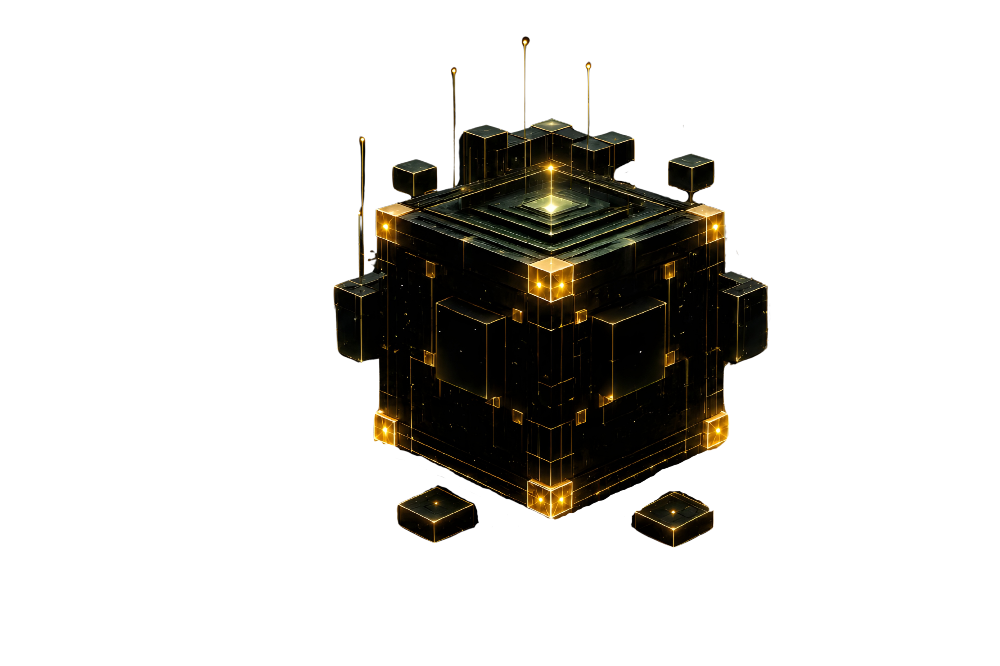

# NUROVELLE – CSS-Animationen und Interaktionen

Status: zusammengestellte Arbeitsreferenz  
Stand: 2026-07-05  
Zweck: zentrale Sammlung der bisher genannten und festgelegten CSS-/UX-Animationen für Homepage und Detailseiten.

Diese Datei ist **keine neue Designfreigabe**. Sie sammelt nur die bisher besprochenen Animationslogiken, damit sie nicht erneut aus Chatverläufen rekonstruiert werden müssen.

---

## 1. Grundregeln

Verbindlich:

- Umsetzung bevorzugt mit HTML/CSS/JS.
- Keine Bildgenerierung für kontrollierbare UI-Komponenten.
- Keine Demo-Farben aus Referenzen übernehmen.
- Keine Demo-Texte übernehmen.
- Keine externen Fonts nur wegen einer Animation importieren.
- Keine externen Scripts wie Prefixfree übernehmen.
- Keine React- oder Styled-Components-Pflicht.
- Mobile-Zustände müssen per Tap/Focus funktionieren.
- Tastaturbedienung, Focus-State und `prefers-reduced-motion` berücksichtigen.

Nicht verwenden:

- Cyan
- Blau als Hauptfarbe
- Violett
- Neon
- Bronze
- Kupfer
- Gaming-/Comic-Buttonwirkung
- Casino-/Spielautomatwirkung

---

## 2. Gemeinsame Design-Tokens

```css
:root {
  --nv-black: #050706;
  --nv-matte-black: #080B09;
  --nv-deep-green: #0A1913;
  --nv-emerald: #112A20;
  --nv-teal-dark: #163A35;
  --nv-text-light: #F5F7F4;
  --nv-text-muted: #B9C3BD;

  --nv-gold-dark: #a54e07;
  --nv-gold-mid: #b47e11;
  --nv-gold-light: #fef1a2;
  --nv-gold-core: #bc881b;
  --nv-gold-border: #a55d07;
  --nv-gold-inner-dark: #8b4208;
  --nv-gold-inner-mid: #b17d10;
  --nv-gold-highlight: #fae385;
  --nv-gold-text-dark: rgb(120, 50, 5);
  --nv-gold-gradient: linear-gradient(160deg, #a54e07, #b47e11, #fef1a2, #bc881b, #a54e07);
  --nv-gold-soft: linear-gradient(135deg, #F9F295, #E0AA3E, #FAF398, #B88A44);

  --nv-radius-card: 18px;
  --nv-radius-button: 999px;
  --nv-ease-premium: cubic-bezier(0.23, 1, 0.32, 1);
  --nv-ease-press: cubic-bezier(.2, .8, .2, 1);
}
```

---

## 3. CTA-Button – Arrow-Reveal zu Gold-Fill

Ursprung: vom Nutzer gelieferte Buttonlogik mit einfahrendem Pfeil, ausfahrendem Pfeil, Textverschiebung und expandierender Kreisfläche.  
Übernommen wird nur die Logik, nicht `greenyellow`, Demo-Text oder React-Struktur.

### HTML

```html
<a class="nv-btn nv-btn-arrow" href="analyse.html">
  <svg class="nv-btn__arrow nv-btn__arrow--in" viewBox="0 0 24 24" aria-hidden="true">
    <path d="M16.1716 10.9999L10.8076 5.63589L12.2218 4.22168L20 11.9999L12.2218 19.778L10.8076 18.3638L16.1716 12.9999H4V10.9999H16.1716Z"></path>
  </svg>
  <span class="nv-btn__text">KI-Potenzialanalyse durchführen</span>
  <span class="nv-btn__fill" aria-hidden="true"></span>
  <svg class="nv-btn__arrow nv-btn__arrow--out" viewBox="0 0 24 24" aria-hidden="true">
    <path d="M16.1716 10.9999L10.8076 5.63589L12.2218 4.22168L20 11.9999L12.2218 19.778L10.8076 18.3638L16.1716 12.9999H4V10.9999H16.1716Z"></path>
  </svg>
</a>
```

### CSS

Siehe Datei `nurovelle-animations.css`, Abschnitt `1. CTA BUTTON: ARROW-REVEAL + GOLD-FILL LOGIK`.

---

## 4. CTA-Button – Press-Button / haptische Absenkung

Ursprung: vom Nutzer gelieferte Buttonlogik mit oberer Buttonfläche, Unterseite und Basis.  
Übernommen wird nur die Press-Logik, nicht Demo-Türkis oder Demo-Grün.

### HTML

```html
<button class="nv-press-button" type="button">
  <span class="nv-press-button__top">Kostenlose Analyse starten</span>
  <span class="nv-press-button__bottom" aria-hidden="true"></span>
  <span class="nv-press-button__base" aria-hidden="true"></span>
</button>
```

### CSS

Siehe Datei `nurovelle-animations.css`, Abschnitt `2. CTA BUTTON: PRESS-BUTTON / HAPTISCHE ABSENKUNG`.

---

## 5. Golden-Button-Farblogik

Vom Nutzer gelieferte Farb-/Materiallogik. Sie dient als Grundlage für hochwertige Goldwirkung, Lichtkante und Innenkante.

```css
:root {
  --nv-gold-dark: #a54e07;
  --nv-gold-mid: #b47e11;
  --nv-gold-light: #fef1a2;
  --nv-gold-core: #bc881b;
  --nv-gold-border: #a55d07;
  --nv-gold-inner-dark: #8b4208;
  --nv-gold-inner-mid: #b17d10;
  --nv-gold-highlight: #fae385;
  --nv-gold-text-dark: rgb(120, 50, 5);
  --nv-gold-gradient: linear-gradient(160deg, #a54e07, #b47e11, #fef1a2, #bc881b, #a54e07);
}
```

Regeln:

- Kein Demo-Text „Golden Button“.
- Kein `role="button"` auf echtem `<button>`.
- Keine Casino-/Spielautomatwirkung.
- Gold darf hochwertig wirken, aber nicht billig glänzen.

---

## 6. Downloadbutton → größerer Danke-/Bestätigungsbutton

Gesuchte Referenzseite wurde nicht wiedergefunden. Die Interaktionslogik ist trotzdem festzuhalten.

### Verhalten

Startzustand:

- Downloadbutton / Anfragebutton

Nach erfolgreicher Aktion:

- Button transformiert in größere Bestätigungsfläche
- Text wechselt zu `Danke`, `Download startet`, `Download bereit` oder `Anfrage erhalten`
- Success-Zustand darf nur nach echter erfolgreicher Aktion gesetzt werden
- Fehler dürfen keinen Danke-Zustand auslösen

### HTML

```html
<button class="nv-download-confirm" type="button" data-download-button>
  <span class="nv-download-confirm__idle">Praxisleitfaden herunterladen</span>
  <span class="nv-download-confirm__success">Danke – Download startet</span>
</button>
```

### JS-Minimalbeispiel

```js
const button = document.querySelector('[data-download-button]');

button?.addEventListener('click', async () => {
  // Hier reale Download-/Formularlogik ausführen.
  // Nur bei Erfolg:
  button.classList.add('is-success');
});
```

### CSS

Siehe Datei `nurovelle-animations.css`, Abschnitt `3. DOWNLOADBUTTON TRANSFORMIERT ZU GROESSEREM DANKE-BUTTON`.

---

## 7. Breadcrumb – Chevron-/Pfeil-Segmente

Ursprung: vom Nutzer gelieferte CSS-Breadcrumb-Referenz.  
Übernommen wird die Chevron-/Pfeil-Logik mit `::after`; ausgeschlossen sind Demo-Farben, Google-Font-Import, Prefixfree-Script und Nummernzwang.

### HTML

```html
<nav class="nv-breadcrumb" aria-label="Breadcrumb">
  <a href="/">Start</a>
  <a href="/leistungen.html">Leistungen</a>
  <span aria-current="page">KI-Potenzialanalyse</span>
</nav>
```

### CSS

Siehe Datei `nurovelle-animations.css`, Abschnitt `4. BREADCRUMB: CHEVRON / PFEIL-SEGMENTE`.

---

## 8. Hero-Animation – Orb hinter Cube / Cube-Entstehung

Status: muss live gesehen werden.  
Ziel: Hero-Cube steht vor einem technischen, ruhigen Orb. Der Cube kann optisch aus dem Orb entstehen.

### HTML

```html
<div class="nv-hero-orb">
  <div class="nv-conic-mask" aria-hidden="true"></div>
  
</div>
```

### CSS

Siehe Datei `nurovelle-animations.css`, Abschnitte:

- `5. HERO: ORB HINTER CUBE / ENTSTEHUNGSEFFEKT`
- `6. HERO: CONIC-/NOISE-MASK BACKGROUND OHNE TEXT`

Regeln:

- Keine Texte im Bild.
- Keine Labels.
- Keine Zahlen.
- Keine cyan/blauen Effekte.
- Animation ruhig, technisch, nicht Sci-Fi-chaotisch.

---

## 9. Divider-Varianten

Status: muss live gesehen werden.

### Variante A – SVG-Schräg-Divider

Prinzip:

- SVG als Section-Trennung
- Nurovelle-Farben einsetzen
- keine Demo-Farben
- keine überlagernden Inhalte

Beispiel:

```html
<div class="nv-divider-svg" aria-hidden="true">
  <svg viewBox="0 0 1440 120" preserveAspectRatio="none">
    <path d="M0,80 L1440,0 L1440,120 L0,120 Z"></path>
  </svg>
</div>
```

```css
.nv-divider-svg {
  line-height: 0;
  background: var(--nv-matte-black);
}

.nv-divider-svg svg {
  display: block;
  width: 100%;
  height: clamp(54px, 7vw, 120px);
}

.nv-divider-svg path {
  fill: var(--nv-deep-green);
}
```

### Variante B – Pure-CSS-Angled-Sections

Siehe Datei `nurovelle-animations.css`, Abschnitt `7. DIVIDER B: PURE-CSS-ANGLED-SECTIONS`.

### Variante C – Diagonal Box / SkewY + Clip-Path

Siehe Datei `nurovelle-animations.css`, Abschnitt `8. DIVIDER C: DIAGONAL BOX / SKEWY + CLIP-PATH`.

---

## 10. Card-Animation – Frosted-Glass / Overlay-Reveal

Ursprung: CodePen-Option für Cards.  
Übernommen wird die Logik: Card-Grundzustand, einfahrende Info-Fläche, Blur-/Overlay-Wirkung, Hover/Tap.

### HTML

```html
<article class="nv-reveal-card">
  <div class="nv-reveal-card__media" aria-hidden="true"></div>
  <div class="nv-reveal-card__base">
    <h3>KI-Agenten</h3>
  </div>
  <div class="nv-reveal-card__info">
    <h3>KI-Agenten</h3>
    <span class="nv-reveal-card__accent" aria-hidden="true"></span>
    <p>Agentenlogik, Tool-Anbindung, MCP, API-Zugriff und Aufgabensteuerung.</p>
  </div>
</article>
```

### CSS

Siehe Datei `nurovelle-animations.css`, Abschnitt `9. CARD: FROSTED-GLASS / OVERLAY REVEAL`.

Mobile-Regel:

- JS setzt `.is-open`.
- Beim Öffnen einer anderen Card schließt die vorherige.

---

## 11. Social-Icon-Animation

Status: bestimmt als CSS/SVG-Umsetzung.  
Regeln:

- Nur Symbol sichtbar.
- Keine Textlabels sichtbar.
- `aria-label` Pflicht.
- Keine Bildgenerierung.
- Farben Nurovelle-kompatibel.

### HTML

```html
<div class="nv-socials">
  <a class="nv-social" href="#" aria-label="LinkedIn">
    <svg viewBox="0 0 24 24" aria-hidden="true"><path d="..."></path></svg>
  </a>
</div>
```

### CSS

Siehe Datei `nurovelle-animations.css`, Abschnitt `10. SOCIAL ICONS: SYMBOL ONLY, HOVER/FOKUS`.

---

## 12. Section-/Board-Prüfvariante

Ursprung: CodePen-Option für Section/Board.  
Status: Prüfvariante, nicht finale Pflicht.

Übernommen werden kann:

- Board-Struktur
- seitliche Icon-Navigation
- Grid-/Panel-Flächen
- aktive Zustände
- Hover-Highlights

Ausgeschlossen:

- Demo-Logo
- Demo-Farben
- Demo-Texte
- Finanz-/Wallet-/Profit-Inhalte
- externe Avatar-/Bild-URLs
- `arial-label`-Fehler; korrekt ist `aria-label`

### CSS

Siehe Datei `nurovelle-animations.css`, Abschnitt `11. BOARD-/DASHBOARD-SECTION ALS PRUEFVARIANTE`.

---

## 13. Mobile-Interaktion für Cards

```js
const cards = document.querySelectorAll('.nv-reveal-card');

cards.forEach((card) => {
  card.addEventListener('click', () => {
    cards.forEach((other) => {
      if (other !== card) other.classList.remove('is-open');
    });
    card.classList.toggle('is-open');
  });
});
```

---

## 14. Reduced Motion

```css
@media (prefers-reduced-motion: reduce) {
  *, *::before, *::after {
    animation-duration: .001ms !important;
    animation-iteration-count: 1 !important;
    scroll-behavior: auto !important;
    transition-duration: .001ms !important;
  }
}
```

---

## 15. Statusübersicht

| Komponente | Status |
|---|---|
| CTA-Button-Animation | bestimmt |
| Golden-Button-Farblogik | aufgenommen |
| Downloadbutton zu Danke-Button | aufgenommen / Referenzseite noch nicht gefunden |
| Breadcrumb-Ausführung | bestimmt |
| Social Buttons | bestimmt |
| Card-Overlay | Prüfvariante |
| Board-/Section-Komponente | Prüfvariante |
| Divider | live prüfen |
| Hero-Animation | live prüfen |

---

## 16. Zugehörige CSS-Datei

Die direkt verwendbaren CSS-Snippets liegen zusätzlich in:

```text
nurovelle-animations.css
```
